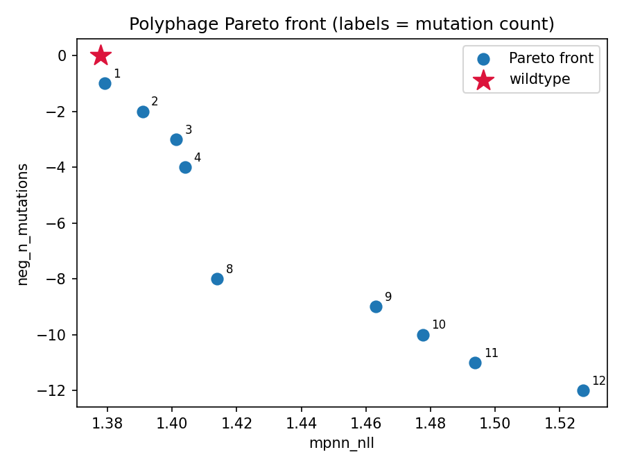

# Polyphage

[](https://colab.research.google.com/github/Sym-jay/polyphage/blob/main/Polyphage.ipynb)

Multi-objective computational design of *Ideonella sakaiensis* PETase
(IsPETase) variants for PET-plastic degradation.

ProteinMPNN proposes sequences against a fixed backbone with the catalytic triad
frozen; ThermoMPNN predicts the stability cost of each mutation; NSGA-II searches
that space under competing objectives and returns a Pareto front rather than a
single "best" sequence.

The problem being targeted: wild-type IsPETase denatures around 46–48 °C, but PET
only becomes accessible to enzymes near its glass transition at 65–70 °C. The
natural enzyme falls apart before the plastic is soft enough to chew.

## Results so far

A 1000-candidate run (40 individuals × 25 generations, 142 s on a T4) produced:

```
n_mut=9   mpnn_nll=1.3151   N37Q R53S T77K K95A T116A T140D Q228A R260F H293V
n_mut=10  mpnn_nll=1.3303   N37Q R53S T77K K95A T116A Q228A R260F T270N S290A H293I
```

Two things worth noting. Both score better than wild-type (1.3783) under
ProteinMPNN. And the first contains **T140D** — position 140, threonine to
aspartate — which is one of the ten mutations in
[DuraPETase](https://doi.org/10.1038/s41467-021-27136-4) (Cui et al. 2021), an
experimentally validated heat-stable PETase. The search had no access to that
paper; it recovered the mutation from structure alone.

**This is not yet a validated claim.** With 15 known hotspot positions among 262
mutable ones, a 9-mutation variant hits *some* hotspot roughly 40% of the time by
chance. The randomization control in `polyphage/control.py` measures this against
an explicit null, and has not been run yet. Treat T140D as promising until that
number exists.



Full run log: [`results/runs.jsonl`](results/runs.jsonl).

## Reference structures

| What | PDB | Note |
|---|---|---|
| Wild-type IsPETase | `6EQE` | 0.92 Å, Austin et al. 2018 PNAS. The design target. |
| Wild-type IsPETase (apo) | `5YFE` | 1.39 Å alternative |
| Wild-type + MHET analog | `5XG0` | 1.58 Å, for later docking validation |
| FAST-PETase | `7SH6` | Lu et al. 2022 Nature. Benchmark only, not a design input. |

Catalytic triad: **Ser160** (nucleophile), **His237** (general base),
**Asp206** (orients His237). Frozen in every design.

Earlier notes in this project cited `6EQM` and `7VVE`. Both were wrong —
`7VVE` is not FAST-PETase at all. Use the table above.

## Layout

```
polyphage/
  encoding.py    vector <-> sequence <-> PDB residue numbers; triad gate
  scoring.py     ProteinMPNN foldability; batched + subprocess reference
  optimize.py    NSGA-II problem, categorical operators, objective specs
  validate.py    hotspot overlap, front reporting, run log, plotting
  control.py     randomization control against an explicit null
  stability.py   ThermoMPNN ddG via a cached site-saturation table
build_notebook.py  generates Polyphage.ipynb
results/           run log and figures
```

**`Polyphage.ipynb` is generated.** Edit the modules, then run
`python3 build_notebook.py` to regenerate it. Hand-edits to the notebook are
discarded by the next build. Never commit a notebook downloaded from Colab —
it carries embedded outputs that make diffs unreadable.

## Usage

Click the Colab badge above, set Runtime → T4 GPU, and run top to bottom.
Cells 4 and 6 are gates: if either raises, stop rather than continuing, because
everything downstream depends on the residue mapping being correct.

Locally:

```python
from polyphage import *

target = load_target("inputs/design_target/6EQE.pdb", "outputs/parsed_6EQE.jsonl")
batch  = BatchScorer(mpnn_dir=".", pdb_path="inputs/design_target/6EQE.pdb")

objectives = [foldability_objective(batch), novelty_objective(target)]
res = run(target, objectives, pop_size=40, n_gen=25, max_mutations=10)
print_front(report_front(target, res, [o.name for o in objectives]))
```

## Design decisions

**Categorical operators, not continuous ones.** Amino acid identity is
categorical. pymoo's default SBX crossover and polynomial mutation assume an
ordered continuous variable, under which "index 5 (F) lies between 4 (E) and
6 (G)" — biochemically meaningless, and it biases the search toward the middle of
the alphabet. `optimize.py` uses uniform crossover and random-reset mutation.

**Mutations can revert.** Without reversion, mutation count only ratchets upward
and the low-mutation end of the front collapses — exactly the end that matters,
since FAST-PETase is 5 mutations.

**Scores are averaged over fixed decoding orders.** ProteinMPNN scores a sequence
under a random autoregressive decoding order, with a spread of ~0.02 nats on this
protein — comparable to the score change from one or two mutations. Averaging over
8 fixed-seed orders makes the objective deterministic and cuts that noise.
Otherwise NSGA-II ranks candidates by dice.

**Stability lookups, not model calls.** ThermoMPNN's site-saturation scan runs
once on the wild-type and is cached as a table, so scoring a variant inside the
loop is a handful of lookups.

## Limitations

Stated plainly, because they bound what this project can claim:

- **No wet-lab validation.** This produces ranked candidates, not verified enzymes.
- **ProteinMPNN's score measures foldability, not function.** Nothing in the
  current objectives measures catalysis. These variants are not shown to degrade
  PET faster, or at all.
- **ddG is additive here.** ThermoMPNN is trained on single point mutants; summing
  per-mutation ddG across a 9-mutation variant ignores epistasis and generally
  overestimates stabilisation. It is a screening heuristic for ranking, not a
  ground truth.
- **Stability and activity can trade off.** Rigidifying a protein can stiffen the
  active site it needs for chemistry.

## Roadmap

1. Randomization control on the T140D finding — gates whether it can be claimed.
2. Three-objective runs: foldability + ddG + mutation count.
3. Activity screen on top candidates: ESMFold → triad geometry check → PET
   oligomer docking (AutoDock Vina / GNINA), measuring Ser160 OG to ester
   carbonyl distance. This is the part that speaks to actual plastic degradation.
4. FastAPI + Docker serving layer, so other researchers can supply their own
   constraints and get ranked sequences back.

## How this was built

The pipeline was developed with AI assistance (Claude Code, Anthropic). That
covered module design and implementation, the ProteinMPNN and NSGA-II
integration, the batched scoring path, and the validation tooling. Commits carry
a `Co-Authored-By: Claude Opus 5.5` trailer.

The scientific direction, the choice of objectives, the structures, and the
interpretation of results are the author's. Several factual errors introduced
early on — notably the wrong PDB accession codes — were caught by verifying
identifiers against RCSB and the primary literature rather than trusting
generated text. That verification step is part of the method, not an aside.

## References

- Austin et al. 2018, *PNAS* — IsPETase structure, 6EQE
- Lu et al. 2022, *Nature* — FAST-PETase (S121E/D186H/R224Q/N233K/R280A), 7SH6
- Cui et al. 2021, *Nature Communications* — DuraPETase
- Dauparas et al. 2022, *Science* — [ProteinMPNN](https://github.com/dauparas/ProteinMPNN)
- Dieckhaus et al. 2024, *PNAS* — [ThermoMPNN](https://github.com/Kuhlman-Lab/ThermoMPNN)
- Deb et al. 2002, *IEEE Trans. Evol. Comput.* — NSGA-II
